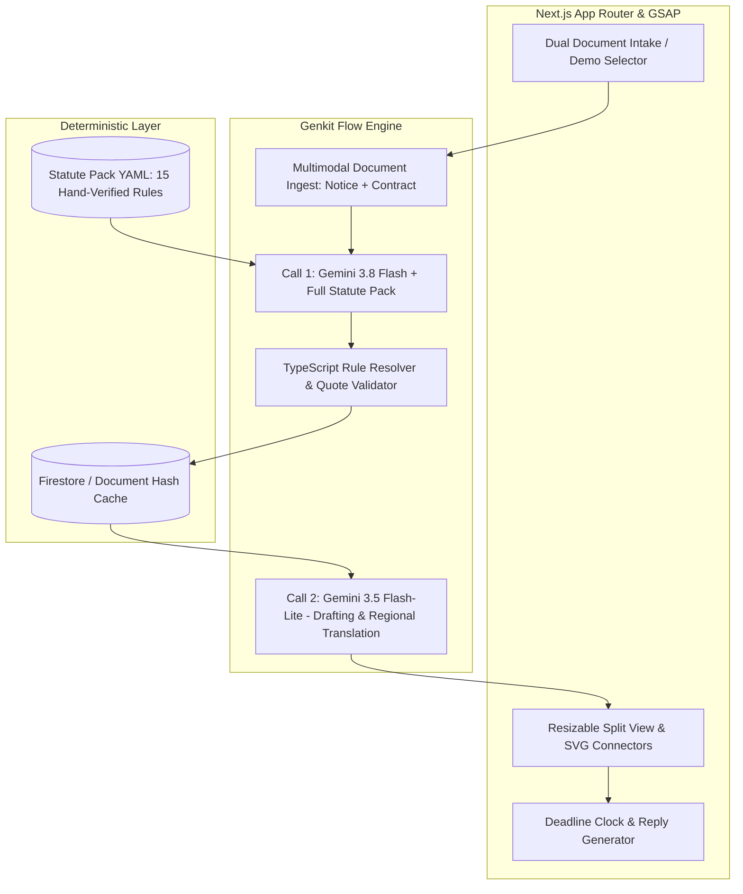

# Jawaab — The Legal Notice Decoder

**Hackathon Blueprint & Execution Plan · AI for Legal Assistance & Access · India**  
**Mode:** Solo Developer · 24-Hour Timed Sprint (with 24–48h Pre-Hackathon Prep)  
**Stack:** Google-Native (Gemini 3.8 Flash, Gemini 3.5 Flash-Lite, Genkit TS, Next.js App Router, Tailwind v4, shadcn v4, GSAP 3.13+, Firestore)

---

## 1. Executive Summary & Core Wedge

**Jawaab** is an AI co-pilot for the exact moment an intimidating legal notice lands in an Indian household. 

Rather than summarizing the notice in isolation (a solved, unimpressive demo), Jawaab’s core differentiator is **cross-examining two documents at once**:
1. **The Notice:** What the advocate/sender is threatening and demanding.
2. **The Underlying Agreement:** What the recipient’s own contract (e.g., loan sanction letter, rent agreement) actually stipulates.

The system places the notice on trial against the contract and governing Indian statutes:
- Validates or debunks every claim (e.g., *"arrest threat"* vs civil debt reality; *"36% penal interest"* vs 18% contract cap).
- Computes exact statutory response deadlines and limitation periods.
- Generates a structured formal reply, a WhatsApp negotiation draft, and a 1-page Lawyer Handoff Pack.
- Produces regional spoken explanations (Hindi/Tamil/etc.).
- Explicitly demonstrates **Responsible AI refusal** on criminal defence or sensitive non-civil matters with helpline routing.

---

## 2. Decision Log

| ID | Decision | Alternatives Considered | Rationale |
|---|---|---|---|
| **DEC-001** | **Solo Developer Sequential Schedule** | Original 3-track parallel schedule | User is building solo in a 24h sprint. A sequential milestone schedule prevents context thrashing. |
| **DEC-002** | **Heavy Pre-Hackathon Prep (Zero Code)** | Drafting statutes & notices during the 24h clock | Authoring synthetic document pairs and the Statute Pack during the 24h would eat 6+ hours. Doing this in prep preserves coding hours for UI and logic. |
| **DEC-003** | **Retain Full GSAP Suite with Sandbox Boundary** | Stripping down to pure CSS / Tailwind transitions | User confirmed commitment to high visual impact. GSAP (`@gsap/react`, DrawSVG, Flip) will be isolated in dedicated client components to prevent SSR hydration errors. |
| **DEC-004** | **1-Click Pre-Loaded Sample Cases on Intake** | Requiring manual PDF uploads during live demo | Fumbling with file pickers during a 4-minute presentation risks timeouts and Wi-Fi lags. 1-click loaders guarantee a deterministic, instant demo. |
| **DEC-005** | **Two Deep Domains + 1 Refusal Demo** | Building 5 domains shallowly | Loan Recall (SARFAESI / NI Act §138) and Tenant Eviction (Model Tenancy / TPA) give maximum depth. Adding an explicit refusal case showcases safety to judges. |
| **DEC-006** | **Golden Fixture Freeze at H2** | Developing against live API calls | Gemini free tier has a strict ~20 calls/day limit on 3.8 Flash. Freezing a real response JSON early allows 100% offline UI development. |

---

## 3. The 4-Screen Architecture & Motion Blueprint

### Visual Identity
- **Tone:** Calm institutional authority, paper-and-ink materiality.
- **Palette (OKLCH):**
  - **Page Background (Paper):** `oklch(0.985 0.004 85)` (Warm off-white)
  - **Document Card:** `oklch(1 0 0)` (Pure white)
  - **Body Text (Ink):** `oklch(0.22 0.012 265)` (Deep cool slate)
  - **Dividers & Rules:** `oklch(0.915 0.004 85)` (Hairline borders)
  - **Verdicts:**
    - **Valid:** `oklch(0.47 0.11 150)` (Controlled forest green tint)
    - **Overstated:** `oklch(0.55 0.12 72)` (Muted amber)
    - **Unsupported:** `oklch(0.52 0.16 45)` (Burnt ochre)
    - **Unenforceable / Illegal:** `oklch(0.48 0.17 25)` (Crimson)
- **Typography:** Inter / Geist (UI tabular numerals) + Source Serif 4 (Quoted legal clauses) + Noto Sans Devanagari (Hindi).

---

### Screen 1: The Intake (`/`)
* **Hero Title:** "Put your legal notice on trial against your contract."
* **Bilateral Drop Zone:**
  - Pane A: Drop Notice PDF/Image.
  - Pane B: Drop Agreement / Sanction Letter PDF.
* **Jurisdiction & Language:** Dropdowns for Indian State (governs tenancy acts) and Explanation Language (English / Hindi / etc.).
* **One-Click Demo Triggers:**
  - `[Demo Case 1: Non-Bank Loan Recall Notice]`
  - `[Demo Case 2: Illegal 7-Day Tenant Eviction]`
  - `[Demo Case 3: Criminal Custody Threat (Refusal Demo)]`

### Screen 2: The Honest Wait (`/analyzing`)
* A serene inspection screen replacing generic spinners with a 4-step real-time progress cascade:
  1. `[✓] Ingesting document tokens & layout...`
  2. `[✓] Extracting advocate claims and asserted penalties...`
  3. `[⏳] Cross-referencing sanction clauses & verifying with Statute Pack...`
  4. `[ ] Calculating statutory response limitation & reply windows...`

### Screen 3: The Findings (`/findings`) — *The Core Wedge*
* **Layout:** `ResizablePanelGroup` split view.
  - **Left Pane (45%):** Notice viewer with highlighted claim spans.
  - **Center Divider:** Dynamic GSAP SVG connector line that smoothly connects the active claim to the answering agreement clause.
  - **Right Pane (55%):** 
    - **Verdict Rail:** Stack of claim cards color-coded by verdict. Each card displays:
      - Claim assertion + verbatim quote badge.
      - Agreement answer + contract clause citation.
      - Statutory citation from Statute Pack.
      - Repealed law badge (e.g. *"Notice cites IPC 420 (Repealed) → BNS 318 applies"*).
    - **Contract Viewer:** Auto-scrolls to the exact answering clause when a claim card is clicked.

### Screen 4: The Action Suite (`/act`)
* Tabbed resolution suite:
  1. **The Deadline Clock:** Circular countdown ring (GSAP DrawSVG), statutory expiry calculation, and one-click `.ics` calendar export.
  2. **Plain-Language & Voice:** Tab showing a plain-language summary in Hindi/regional language with an interactive audio player (Cloud TTS / browser speech).
  3. **Reply Generator:** Side-by-side formal advocate response draft vs. informal WhatsApp negotiation script.
  4. **Lawyer Handoff Pack & Escalation:** 1-page printable brief framing the facts, issues, and specific questions for legal counsel, plus direct routing to NALSA, e-Daakhil, or State RERA.

---

## 4. Technical Architecture: Two Calls, Zero RAG



### Why No Vector DB / RAG:
Gemini 3.8 Flash has a **1,048,576-token context window**. Both documents (~10–30 pages) plus the entire Statute Pack (~5,000 tokens) fit comfortably in a single prompt. Eliminating chunking, embeddings, and vector databases eradicates an entire class of retrieval bugs.

---

## 5. Implementation Roadmap (Solo 24-Hour + Prep)

### Phase 0: Mandatory Prep (Pre-H0, Next 24–48h)
*Do not spend hackathon clock on these:*
1. **Draft Document Pairs:**
   - Case 1 (Loan): Notice (₹4.8L demand, 36% interest, arrest threat) + Sanction Letter (2 defaults, 18% cap, civil remedy).
   - Case 2 (Rent): Notice (7-day eviction, deposit forfeit) + Rent Agreement (30-day notice, deposit return).
   - Case 3 (Refusal): Criminal / domestic matter.
2. **Author `statutes.yaml`:** 12–15 hand-verified rules with section numbers, verified dates, and authorities.
3. **Credentials:** Set up Google Cloud project, AI Studio API key, test Gemini 3.8 Flash call locally.

---

### Phase 1: The 24-Hour Hackathon Execution

| Timeframe | Milestone | Key Deliverables | Checkpoint |
|---|---|---|---|
| **H0 – H2** | **Scaffolding & Golden Fixture** | • Initialize Next.js 15, Tailwind v4, shadcn CLI v4.<br>• Run **one** Gemini 3.8 Flash call on prep documents; freeze output as `golden_fixture.json`. | 🎯 Rest of the build can proceed 100% offline with zero quota risk. |
| **H2 – H6** | **Law Engine & Genkit Flow** | • Build Zod schema for structured extraction.<br>• Implement `statute-resolver.ts` (YAML rule matcher).<br>• Implement `deadline-math.ts` & `quote-validator.ts`. | 🎯 `npm test` passes against the golden fixture. Data models locked. |
| **H6 – H11** | **Design System & Findings View** | • Install shadcn primitives (`resizable`, `card`, `badge`, `tabs`).<br>• Apply Paper/Ink OKLCH palette.<br>• Build **Screen 3 (Findings)** with Resizable split panels and color-coded Verdict Rail. | 🎯 Findings screen renders interactively using the golden fixture. |
| **H11 – H15** | **GSAP Motion & SVG Connectors** | • Integrate `@gsap/react` in `"use client"` wrappers.<br>• Build the dynamic cross-pane SVG connector lines.<br>• Animate the Verdict cascade and Deadline Ring. | 🎯 Visual wow-factor complete; no layout jumps or SSR errors. |
| **H15 – H18** | **Intake, Wait & Action Screens** | • Screen 1: Dual drop zone + 1-click sample loaders.<br>• Screen 2: 4-stage narrated wait timeline.<br>• Screen 4: Tabbed Deadline Clock, Reply Generator, Lawyer Pack. | 🎯 Full end-to-end user navigation works smoothly. |
| **H18 – H20** | **Live API & Cache Integration** | • Wire frontend to Genkit flow.<br>• Add SHA-256 document hashing for instant cache retrieval (<500ms).<br>• Wire up Refusal Case route with helpline badges. | 🎯 Real Gemini API calls work; repeated analyses are instant. |
| **H20 – H22** | **Audio & Multilingual Polish** | • Connect Cloud TTS / Web Speech API for Hindi voice playback.<br>• Check typography and Devanagari line-heights. | 🎯 Spoken Hindi decode operational. |
| **H22 – H24** | **Rehearsal & Demo Armor** | • Rehearse 4-minute presentation 3 times.<br>• Record high-res backup demo video.<br>• Pre-warm Firestore/local cache with demo cases. | 🎯 Demo is bulletproof against Wi-Fi or API failures. |

---

## 6. The 4-Minute Demo Script

| Timestamp | Screen | Spoken Pitch / Action |
|---|---|---|
| **0:00 – 0:20** | **Screen 1 (Intake)** | *"When an ordinary Indian receives a legal notice, fear paralyzes them because they have never read their own agreement. Today, we put the notice on trial."* Click **[Demo Case 1: Loan Recall]**. |
| **0:20 – 0:40** | **Screen 2 (Wait)** | Watch the 4-step narrated analysis. Explain that this is a single, deterministic, zero-RAG Gemini 3.8 Flash call using the full contract context. |
| **0:40 – 1:45** | **Screen 3 (Findings)** | The verdict rail cascades in. Three claims are flagged red/orange. Click the arrest threat: the SVG connector highlights the sanction letter clause and displays the civil law citation. Point out the repealed IPC vs BNS detection. |
| **1:45 – 2:30** | **Screen 4 (Clock & Act)** | Switch to the Deadline Clock: *"11 days to reply, 23 months limitation."* Export to calendar in one click. Switch to Hindi voice playback. |
| **2:30 – 3:15** | **Screen 4 (Reply & Pack)** | Show the formal reply vs WhatsApp draft. Open the Lawyer Handoff Pack: *"We don't replace advocates; we save the first ₹5,000 consult fee by organizing the file."* |
| **3:15 – 3:45** | **Refusal Case** | Click **[Demo Case 3: Custody Threat]**. Show the polite refusal and instant routing to NALSA & emergency helplines. Highlight Responsible AI compliance. |
| **3:45 – 4:00** | **Closing** | *"Built on Google Genkit and Gemini inside the free-tier quota: two calls, zero hallucinated statutes, five artifacts."* |

---

## 7. Statute Pack Starter Schema (`statutes.yaml`)

```yaml
# Jawaab Verified Statute Pack v1.0
- id: SARFAESI-CIVIL-001
  claim_type: threat_of_arrest_debt
  verdict: unenforceable
  statute: "Code of Civil Procedure, 1908 / SARFAESI Act, 2002"
  section: "Section 51 CPC / RBI Fair Practices Code"
  authority: "Jolly George Varghese v. Bank of Cochin (SC 1980)"
  verified_by: "AMJ"
  verified_on: "2026-09-18"
  plain_language: >
    Non-payment of a civil loan cannot lead to arrest or criminal imprisonment 
    unless deliberate fraudulent evasion is proven in court.
  escalate_to_human: false

- id: NI-ACT-138-NOTICE-001
  claim_type: cheque_dishonour_window
  verdict: valid
  statute: "Negotiable Instruments Act, 1881"
  section: "Section 138(b)"
  authority: "Statutory mandatory notice"
  verified_by: "AMJ"
  verified_on: "2026-09-18"
  response_window_days: 15
  plain_language: >
    The recipient has exactly 15 days from the date of receipt of the notice 
    to make the payment before criminal proceedings can be initiated.
  escalate_to_human: true

- id: TENANCY-EVICTION-001
  claim_type: summary_eviction_7day
  verdict: unsupported
  statute: "Transfer of Property Act, 1882 / Model Tenancy Act, 2021"
  section: "Section 106 TPA"
  authority: "Statutory 15/30 day requirement"
  verified_by: "AMJ"
  verified_on: "2026-09-18"
  response_window_days: 30
  plain_language: >
    A landlord cannot demand eviction in 7 days. Monthly tenancies require 
    at least 15 to 30 days of written notice prior to initiating legal action.
  escalate_to_human: false
```
